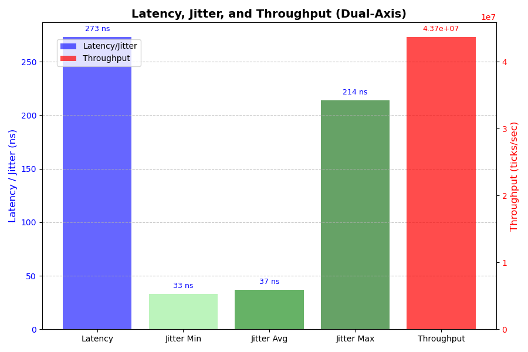

# Low-Latency Market Data Feed Handler

[](ca://s?q=C++20_standard_explained)
[](ca://s?q=MIT_License_explained)
[](ca://s?q=Build_status_badge_explained)

---

## Overview
A high-performance C++ system designed to ingest simulated exchange tick data at millions of messages per second, parse binary protocols, and update in-memory structures with nanosecond precision.  
This project demonstrates expertise in **network I/O optimization, memory alignment, lock-free concurrency, and SIMD/vectorization** — core skills for high-frequency trading and performance-critical industries.

---

## Objectives
- Implement ultra-fast I/O ingestion (`epoll`/`io_uring`)
- Build binary protocol parser with cache-aware design
- Develop lock-free ring buffers with aligned memory
- Apply SIMD intrinsics for parsing acceleration
- Benchmark latency histograms and throughput metrics
- Document results with descriptive charts

---

## Key Features
- **I/O Layer**: ultra-fast socket ingestion with `epoll`/`io_uring`
- **Parser**: binary protocol decoding with cache-aware design
- **Data Structures**: lock-free ring buffers, aligned memory
- **Optimizations**: SIMD intrinsics, memory alignment
- **Benchmarks**: latency histograms, throughput metrics
- **CI/CD Workflow**: automated build, benchmark, and plotting via GitHub Actions
- **Industry Relevance**: demonstrates lock-free concurrency advantages in trading/HFT systems

---

## Setup Instructions

### 1. Clone the repository
```bash
git clone git@github.com:iswastik3k/low-latency-feed-handler.git
cd low-latency-feed-handler
```

### 2. Build (CMake)
```bash
mkdir build && cd build
cmake ..
make -j$(nproc)
```

### 3. Run Benchmark
```bash
./benchmarks
cd ..
```

### 4. Plot Results
```bash
python3 -m venv .venv
source .venv/bin/activate
pip install -r requirements.txt
python scripts/plot_results.py
```

---

## Benchmark Results

| Metric       | Value           |
|--------------|-----------------|
| Latency      | 276 ns          |
| Jitter (avg) | 38 ns           |
| Throughput   | 45.5M ticks/sec |

### Charts

> Latency and jitter are measured on the left axis (ns), while throughput is measured on the right axis (ticks/sec).

---

## Workflow
- Ingest simulated tick data
- Parse binary protocols with SIMD acceleration
- Update lock-free in-memory structures
- Benchmark latency and throughput
- Export results to CSV and plot recruiter-friendly charts
- CI/CD ensures reproducibility on every push

---

## System
- OS: Arch Linux
- CI/CD: Ubuntu runner (GitHub Actions)
- C++: 20 (optimized with -O3 -march=native -pthread)
- Python: 3.9+ (for plotting, via requirements.txt)

---

## Author
Developed by [Swastik](https://github.com/iswastik3k)

---

## License
This project is licensed under the MIT License — see the [LICENSE](LICENSE) file for details.

---

## Future Work
- Multi-core scaling
- NUMA-aware memory placement
- Integration with real exchange feed
